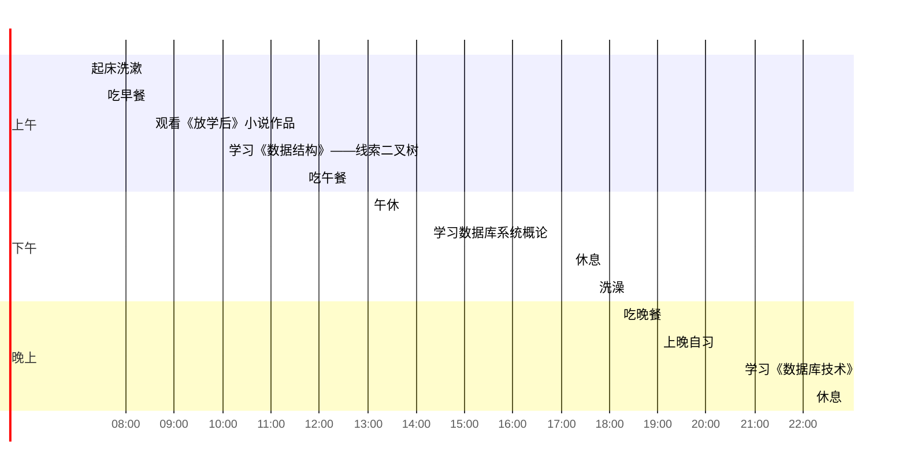

## 上午
- [ ] 07:10 起床洗漱
- [ ] 07:30 - 08:10 吃早餐
早餐在一天当中是十分重要的，因此一顿好的早餐非常有必要
- [ ] 08:30 - 09:45 观看《放学后》小说作品
这部作品是东野圭吾的，他算是我非常喜欢的一个作家，作品之优秀不用多说
- [ ] 10:00 - 11:30 学习《数据结构》——线索二叉树
今天所学是纯理论知识
想要编写出一个性能优秀的程序，数据结构是必须需要学习的
- [ ] 11:40 - 12:30 吃午餐

## 下午
- [ ] 13:00 - 14:00 午休
充足的午休时间能为下午的学习的带来更好的状态
- [ ] 14:15 - 17:00 学习数据库系统概论
为了备战明年三月份的计算机三级考试，学习数据库系统概论迫在眉睫
- [ ] 17:10 - 17:30 休息
- [ ] 17:40 - 18:00 洗澡

## 晚上
- [ ] 18:10 - 18:40 吃晚餐
- [ ] 19:00 - 20:00 上晚自习
- [ ] 20:40 - 22:00 学习《数据库技术》
- [ ] 22:10 休息